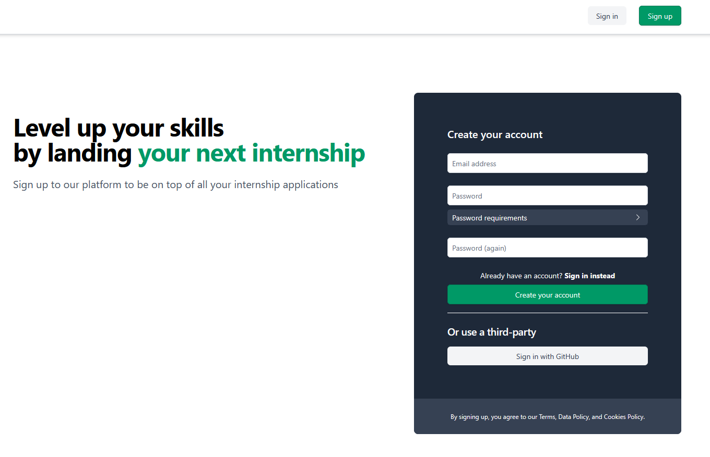

# LevelUp Project (CSC430)

LevelUp is a web application designed for students and faculty to explore available internships and job opportunities. The platform offers user authentication features, including sign-in and sign-up options, facilitating a seamless experience for users seeking career advancement resources.

## Features
* **User Authentication**: Secure sign-in and sign-up functionalities for students and faculty members.
* **Internship & Job Listings**: Access to a curated list of available internships and job opportunities.
* **User-Friendly Interface**: An intuitive design ensuring easy navigation and usability.

## Technologies Used
The project leverages a combination of technologies to deliver its features:
* **Frontend**
  * HTML
  * TailwindCSS
* **Backend**
  * Python
  * AlpineJS
* **Frameworks**
  * Django
* **Others**
  * Docker/Docker Compose
 
## Getting Started
To set up and run the project locally, follow these steps:

**1. Clone the Repository:**

`git clone https://github.com/egorgusev1/LevelUp_project_csc430.git`

**2. Navigate to the Project Directory:**

`cd LevelUp_project_csc430`

**3. Build and run the project in Docker Compose**

`docker compose up --build`

**4. Access the Application**

Open your browser and navigate to http://localhost:8000

## Contributing

Contributions are welcome! If you'd like to contribute to the project, please fork the repository and submit a pull request. For major changes, kindly open an issue first to discuss the proposed changes.

## Acknowledgments

Developed as part of the CSC430 course project by:

* Egor
* Owen
* Matteo

